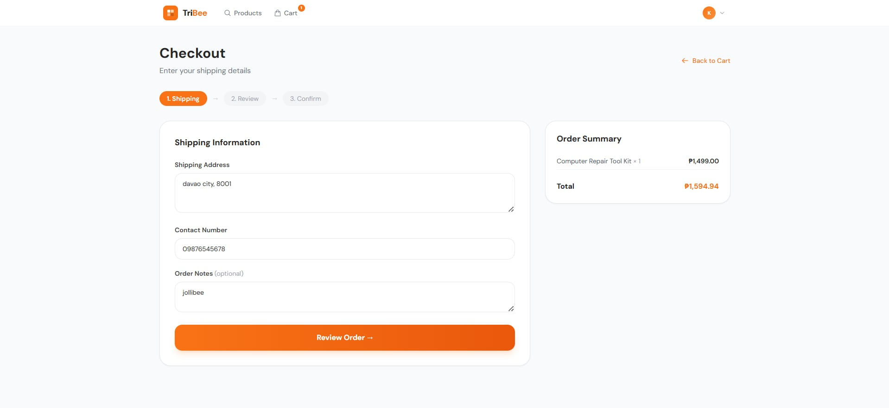
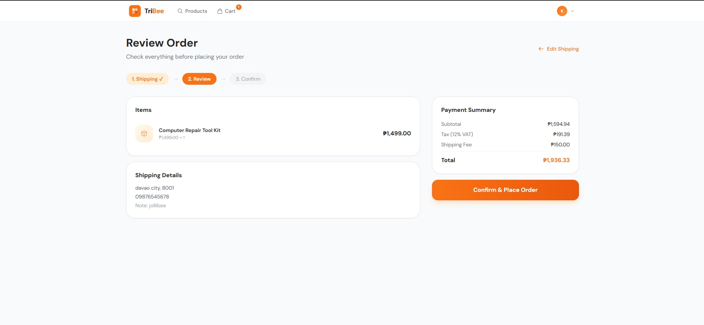
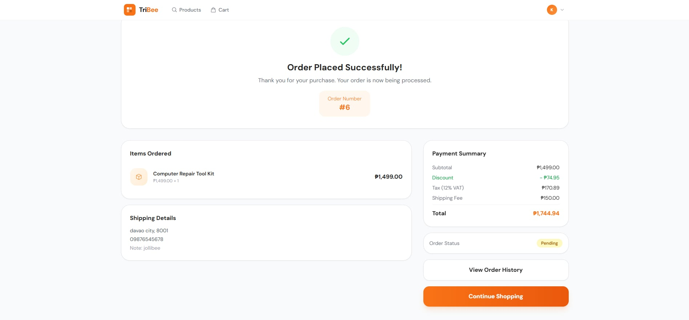
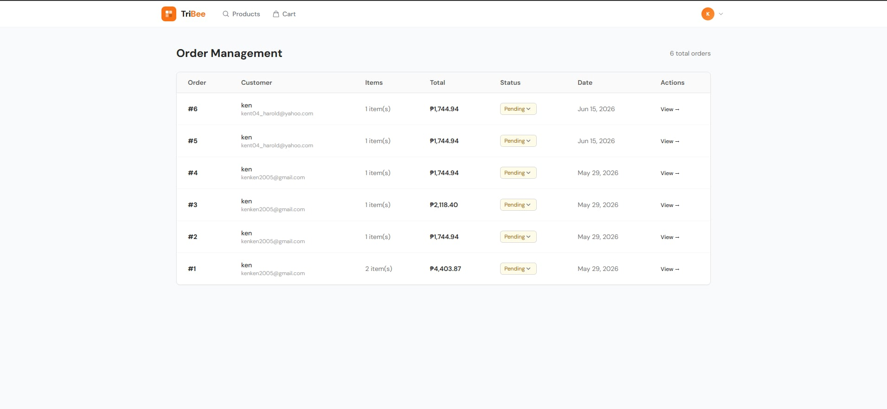

# TriBee 🛒

> A full-featured Laravel e-commerce platform built as a collaborative group project. I served as **DevOps Lead** and built the entire **Orders & Checkout module**.

<p align="center">
  
  
  
  
</p>

---

## 📦 About the Project

TriBee is a modular monolith e-commerce web application built with Laravel 11 and Blade. The project was split across 5 modules — Authentication, Products, Cart, Orders/Checkout, and Payment — each handled by a separate group. I was responsible for the **Orders & Checkout module** and served as the team's **DevOps Lead**, managing Git branching strategy, merge conflicts, and the final integration into main.

---

## 🧩 My Module — Orders & Checkout

I designed and built the entire order flow from cart to confirmation:

### 3-Step Checkout Flow
- **Step 1 — Shipping** — Collect delivery address, contact number, and optional order notes. Live order summary sidebar showing items and total
- **Step 2 — Review** — Full order review with itemized payment summary including subtotal, 12% VAT, shipping fee, and discounts before confirming
- **Step 3 — Confirm** — Order placed confirmation page with order number, full payment breakdown, order status badge, and links to order history

### Order Management (Admin)
- Full admin dashboard listing all orders with order number, customer, item count, total, status, and date
- Inline status update dropdown (Pending → Processing → Shipped → Delivered)
- Per-order detail view

### Backend
- `Order` and `OrderItem` models with full relationships
- `OrderController` handling checkout flow, order creation, and admin management
- Automatic tax (12% VAT) and shipping fee calculation
- Discount application logic
- Order status management

---

## 🛠 Tech Stack

| Layer | Tech |
|---|---|
| Framework | Laravel 11 |
| Frontend | Blade Templates |
| Database | MySQL |
| Auth | Laravel Breeze |
| Styling | Tailwind CSS |
| Build Tool | Vite |
| Version Control | Git + GitHub |

---

## 📸 Screenshots

| Checkout — Shipping | Checkout — Review |
|:-:|:-:|
|  |  |

| Order Confirmed | Order Management (Admin) |
|:-:|:-:|
|  |  |

---

## 🚀 Getting Started

### Prerequisites
- PHP 8.2+
- Composer
- MySQL
- Node.js 18+

### Installation

```bash
git clone https://github.com/Kentlui2/TriBee.git
cd TriBee
composer install
npm install
cp .env.example .env
php artisan key:generate
```

### Database Setup

```bash
# Configure your DB credentials in .env, then:
php artisan migrate --seed
```

### Run

```bash
php artisan serve
npm run dev
```

---

## 🗂 Project Structure (My Module)

```
app/
├── Models/
│   ├── Order.php
│   └── OrderItem.php
├── Http/Controllers/
│   └── OrderController.php
resources/views/
├── orders/
│   ├── checkout.blade.php      # Step 1 - Shipping
│   ├── review.blade.php        # Step 2 - Review
│   ├── confirmed.blade.php     # Step 3 - Confirmation
│   ├── index.blade.php         # Customer order history
│   ├── show.blade.php          # Order detail view
│   └── admin/
│       ├── index.blade.php     # Admin order management
│       └── show.blade.php      # Admin order detail
database/migrations/
├── create_orders_table.php
└── create_order_items_table.php
```

---

## 👤 Author

**Ken Lui**
GitHub: [@Kentlui2](https://github.com/Kentlui2)

---

## 📄 License

Built for academic purposes.
